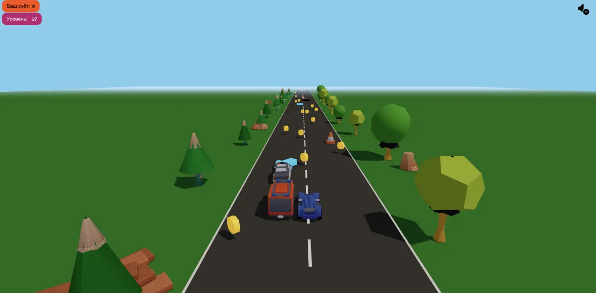

<h1> <a href="https://maxim-belyi.github.io/Racer3D/" target="_blank">
🏎️💨 Racer 3D: Survival Racing </a> </h1>
<br>

Динамичный трёхмерный аркадный симулятор гонок на выживание, созданный на **Three.js** и **JavaScript**. Управляйте автомобилем, соревнуйтесь с интерактивными AI-ботами, подбирайте бонусы, уклоняйтесь от дорожных конусов и камней, покупайте новые спорткары и суперкары в гараже!

<br>

<p align="center">

</p>

<br>

### 🎮 Ключевые особенности

* **3D Графика и Динамическое Окружение**:
  * Реалистичная трехмерная сцена на **Three.js** с панорамным 360° Skybox.
  * Трасса с прорисованными 3D-моделями деревьев, цветов, грибов, скал, указателей и лагерей.
  * Камера с эффектом преследования (`ChaseCamera`) и динамическим покачиванием кузова при поворотах.

* **Интеллектуальные ИИ-Соперники (Human-like AI Bots)**:
  * Гонщики-боты с независимой скоростью, собственными траекториями и характером вождения.
  * Боты умеют объезжать конусы и камни, охотиться за монетками и использовать неоновые турбо-стрелки для обгона.

* **Бонусы и Пауэр-апы**:
  * 🪙 **Золотые монеты** (`coin.glb`) — собирайте монеты для покупки новых машин и улучшений.
  * 🧲 **Магнит** (`magnet.glb`) — затягивает все монеты на трассе к вашей машине.
  * ⚡ **Турбо-стрелки** (`arrow.glb`) — дают мощное неоновое ускорение.
  * 🚧 **Препятствия** — дорожные конусы (`cone.glb`) и россыпи камней (`stones.glb`), замедляющие машину.

* **Гараж и Магазин Автомобилей**:
  * 4 категории машин: **Стандарт**, **Спорт**, **Суперкары** и **Премиум** (включая Полицию, F1, Кибер-болид и хэтчбеки).
  * Уникальные характеристики скорости и маневренности для каждой машины.
  * Интерактивный 3D-просмотр и слайдер авто на базе **Swiper.js**.

* **Адаптивное Управление**:
  * Поддержка ПК (клавиатура `W/A/S/D` или стрелки) и сенсорных кнопок для мобильных устройств.

* **Сохранение и Интеграция Yandex Games SDK**:
  * Автоматическое сохранение баланса монет, купленных машин и уровня прогресса в `LocalStorage`.
  * Функция возрождения за рекламу и удвоения наград (x2 монеты).

<br>

### 🛠️ Стек технологий


<br>

### ⚙️ Установка и локальный запуск

Для запуска проекта локально убедитесь, что у вас установлен [Node.js](https://nodejs.org/ru/) (v16 или выше).

1.  **Клонируйте репозиторий:**
    ```bash
    git clone https://github.com/Maxim-Belyi/Racer3D.git
    ```

2.  **Перейдите в папку проекта:**
    ```bash
    cd Racer_3D
    ```

3.  **Установите зависимости:**
    ```bash
    npm install
    ```

4.  **Запустите сервер разработки:**
    ```bash
    npm run dev
    ```

5.  **Сборка для продакшена:**
    ```bash
    npm run build
    ```

---
